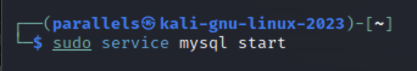

Klassinen SQL-injektio
===
Klassinen SQL-injektio (classic SQLI) on yleisin ja helppokäyttöisin injektiotyyppi.

Kyseisessä injektiometodissa on tarkoituksena lisätä dynaamisen SQL-lauseen
WHERE-operandille lisäehtoja ja parametrejä, joilla lausekkeiden logiikkaa muutetaan.

Lauseille voidaan antaa myös UNION-operandi, jonka avulla kyselyyn voidaan lisätä
kokonaan uusia SQL-lauseita, mahdollistaen tietokannan relaatioiden muokkaamisen tai lisäämisen ja poistamisen.

WHERE-lausekkeiden tyypillisin käyttötarkoitus on järjestelmiin kirjautuminen ilman todenmukaisia tunnistetietoja. Tätä havainnollistaakseen alla on esimerkki yksinkertaisesta klassisesta SQL-injektiototeutuksesta, jossa järjestelmään kirjaudutaan ilman tiedossa olevia tunnuksia.

Kirjautumissivustolla hyökkääjä syöttää käyttäjätunnukseksi ja salasanaksi merkkijonon ’ OR ’1’ = ’1’ 

Sovellusohjelma muodostaa dynaamisesti käyttäjän täydentämän SQLlauseen.

SELECT * FROM users WHERE username = '' OR '1'='1' AND
password = '' OR '1'='1';

1 = 1

Lauseen alkuperäisenä tarkoituksena on tarkastaa, löytyykö tietokannasta käyttäjää annetuilla parametreillä. Hyökkääjän antama parametri lisää lauseelle lisäehdon, joka tarkistaa tunnusten lisäksi onko 1 sama kuin 1. 

Tämä muuttaa lauseen logiikkaa: SQL:n ei tarvitse todentaa, onko käyttäjänimi sekä salasana oikein, koska lisäehto palauttaa aina arvon tosi. Hyökkääjän on siis mahdollista nyt kirjautua järjestelmään ilman oikeanlaisia tunnuksia,
joita tavallisella toiminnalla vaadittaisiin.

Samankaltaista tekniikkaa voidaan soveltaa kirjautumislomakkeiden lisäksi myös muissa lomakkeissa, jossa ohjelma vastaanottaa käyttäjän syöttämää tekstiä josta muodostetaan SQL-lause.

Web-sovellukset, joissa sivun osoite (URL) sisältää SQL-parametrejä, voidaan hyödyntää samalla tavalla klassisen injektion toteuttamiseksi. WHERE-lausekkeen muokkaamisella voidaan vaikuttaa ainoastaan siihen relaatioon, mihin se on alunperinkin tarkoitettu, mutta UNION-operandin lisäyksellä voidaan viitata myös toisiin relaatioihin.

UNION-operandi sallii useamman SQL-lausekkeen yhdistämisen, joka ajetaan yhtenäisenä palvelimelle. 

Haasteena kyseisen operandin käytössä on koko lausekkeen muodostama rakenne, jonka on oltava samankaltainen lausekkeen jokaiselta osalta jotta lause olisi syntaktisesti oikein.

# Tehtävä

Toinen esimerkki SQL injektiosta, jossa hyökkääjä hyödyntää haavoittuvaa Python koodia.

1. Asenna KaliLinuxille mysql serveri.

```sudo apt install mysql-common``````


2. Käynnistä mysql serveri

```sudo service mysql start```




3. Tehdään vähän tietokantaa, johon hyökätään. Kalin terminaalissa kirjaudu mysql
serverille.
``````
sudo mysql -u root
create user 'dummy'@'localhost' identified by 'pass';
GRANT ALL PRIVILEGES ON sample.* TO 'dummy'@'localhost';
flush privileges;
```
4. Luodaan tietokanta ja lisätään dataa tietokantaan
```
create database sample;
show databases;
use sample;
create table userdata(Name varchar(10), Country varchar(3)); 
insert into userdata (Name, Country) values ('Eero', 'FI'), ('Mikko','FI'), ('Marja', 'FI'), ('Börje', 'SWE');
```
5. Nyt on python ja MySQL valmiina. Mutta MySQL:n käyttämiseen Pythonilla
tarvitaan MySQL-connector. Asenna mysql connector ajamalla seuraava komento
KaliLinuxin terminaalissa. Huom. Ei siis mysql terminaalissa!

```
import mysql.connector
db = mysql.connector.connect(host="localhost", user="dummy",
passwd="pass", db="sample")
cur = db.cursor()
name = input("Anna nimi: " )
cur.execute("SELECT * FROM userdata WHERE Name = '%s';" % name)

for row in cur.fetchall(): print(row)
db.close()
```

# SQL Injektio Pythonilla

Käynnistä ohjelma terminaalissa komennolla 

```python injektio.py```


Jos käyttäjä syöttää oikeutetun hakuarvon, esimerkiksi Eero, kaikki on hyvin. Mutta jos hyökkääjä testaa onko Python koodissa haavoittuvuus. Esimerkiksi näin:

```Eero'; DROP TABLE userdata```


niin tulokset ovat kohtalokkaita. Kokeile mitä tapahtuu.

# Sanitointi

Mysql tietokantojen turvaamisessa käytetään usein termiä sanitointi (sanitizes).
Tässä esimerkissä koodin ja syötteen sanitointi on kohtuullisen helppoa. 

Korjaamalla rivi 

cur.execute("SELECT * FROM userdata WHERE Name = '%s';" % name)

siten, että koodi on kirjoitettu näin:

cur.execute("SELECT * FROM userdata WHERE Name = %s;", (name,))

Tämä on vain muutama esimerkki siitä, kuinka SQL-injektiot voivat olla haitallisia. 

Lisää esimerkkejä SQL-injektioista ja niiden vaikutuksista täältä. 

https://portswigger.net/websecurity/sql-injection

Hacking with Python 1 - SQL Injection: https://www.youtube.com/watch?v=IVHX9jDrI0o


